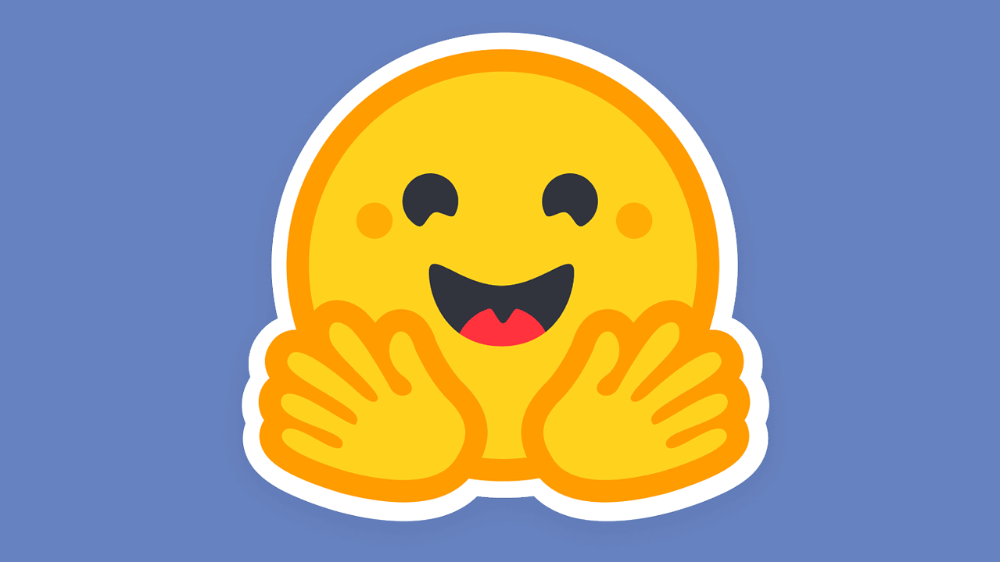
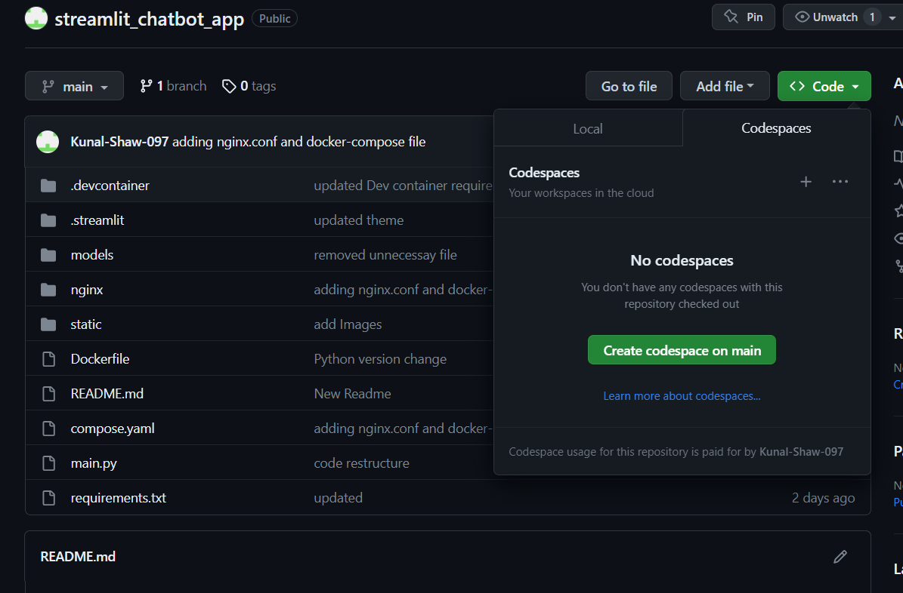
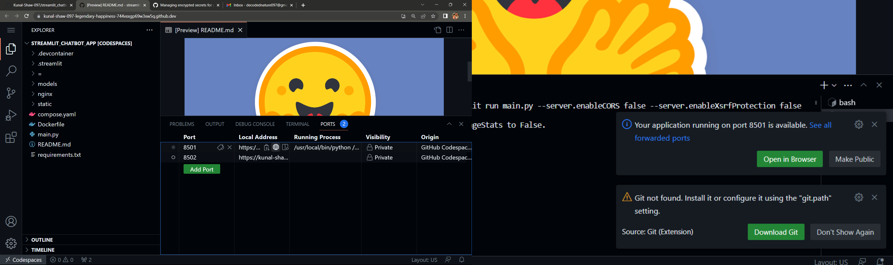

# STREAMLIT CHATBOT WEB APP

This web app is made using [**Streamlit**](https://streamlit.io/).
###

###
The models used are Facebook/[**Blenderbot-400M-Distill**](https://huggingface.co/facebook/blenderbot-400M-distill?text=Hey+my+name+is+Thomas%21+How+are+you%3F) and Microsoft/[**DialoGPT-medium**](https://huggingface.co/microsoft/DialoGPT-medium?text=Hey+my+name+is+Clara%21+How+are+you%3F) , using the *Python* library [**Transformers**](https://huggingface.co/docs/transformers/index) by HuggingFace . 
###

# Using Github Codespace to run this project!

###
Click on the "create codespace on main" tab and please wait for 5 mins :)

After 5 minutes, a Web Vscode editor instane should open.

Wait another 20-30 sec for all the proesses to finish and then head over to the ports section and click on the "Globe" icon as displayed on the left image above, or just wait for the prompt shown on the right image above to show up and click on "Open in Browser".

This should route you to a website which is being hosted from your github codespace :)

Now you can chat to the models and have fun !

**Note : After you are finished testing the models, make sure you delete your codespace.**

[Follow the instruction to delete your codespaces.](https://docs.github.com/en/codespaces/developing-in-codespaces/deleting-a-codespace?tool=webui)
